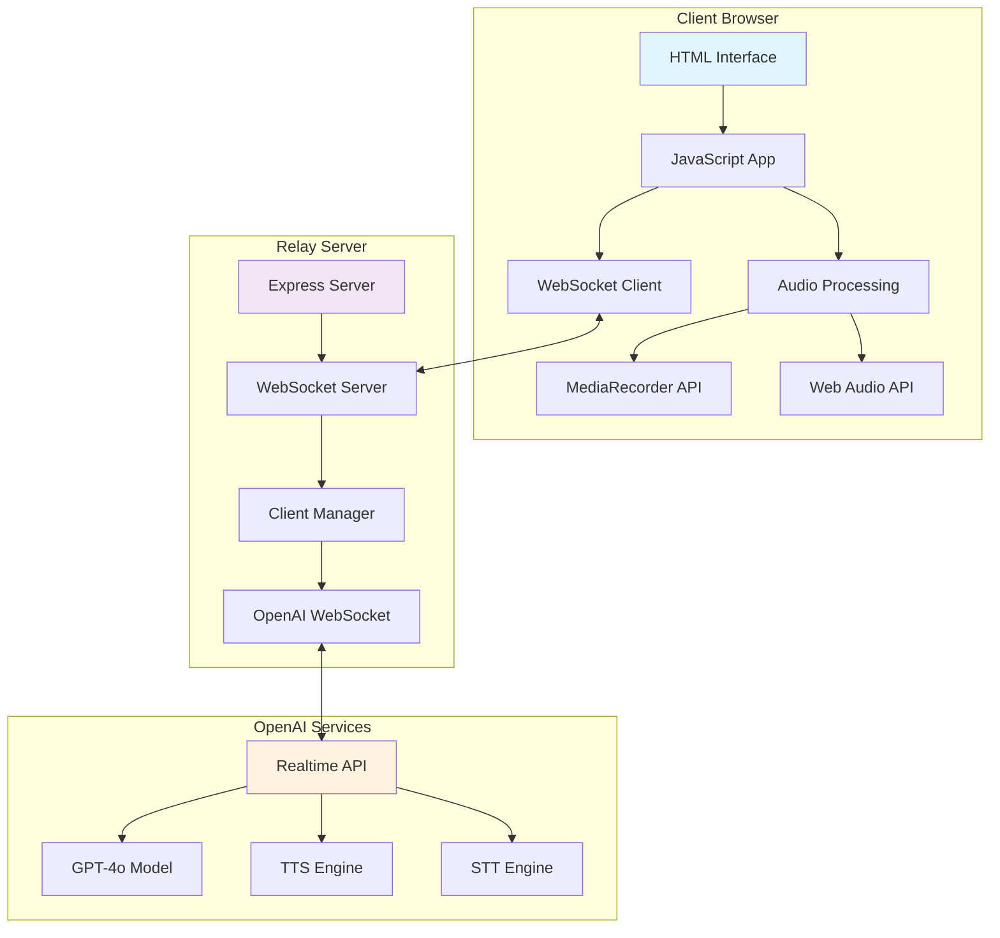

# Realtime GPT Chat Architecture

## System Overview



## Data Flow

### Text Message Flow
```
┌─────────────┐    1. Text Input    ┌─────────────┐    2. Forward      ┌─────────────┐
│   Browser   │────────────────────►│Relay Server │───────────────────►│ OpenAI API  │
└─────────────┘                     └─────────────┘                    └─────────────┘
       ▲                                    ▲                                 │
       │ 6. Display Response                │ 5. Forward Response             │
       │                                    │                                 ▼
       │                                    │                          ┌─────────────┐
       │                                    │                          │ GPT Process │
       │                            ┌─────────────┐    4. Text Response│   & TTS     │
       └────────────────────────────│   Client    │◄───────────────────┴─────────────┘
                                    │ Management  │    3. Audio Response
                                    └─────────────┘
```

### Voice Message Flow
```
┌─────────────┐    1. Audio Capture ┌─────────────┐    2. PCM16 Audio  ┌─────────────┐
│   Browser   │────────────────────►│Relay Server │───────────────────►│ OpenAI API  │
│             │                     │             │                    │             │
│ MediaRecorder                     │Audio Buffer │                    │   STT + GPT │
│   PCM16     │                     │ Management  │                    │   + TTS     │
└─────────────┘                     └─────────────┘                    └─────────────┘
       ▲                                    ▲                                 │
       │ 6. Play Audio                      │ 5. Audio Chunks                 │
       │                                    │                                 ▼
       │                            ┌─────────────┐    4. Process Audio ┌─────────────┐
       └────────────────────────────│Web Audio API│◄───────────────────│   Response  │
                                    │   Player    │    3. Audio Delta   │  Processing │
                                    └─────────────┘                     └─────────────┘
```

## Component Details

### Frontend Components

#### HTML Interface (`public/index.html`)
- Responsive design with modern CSS
- Chat messages display
- Audio controls and level indicator
- Connection status indicator

#### JavaScript Application (`public/app.js`)
- **RealtimeGPTChat Class**: Main application controller
- **WebSocket Management**: Connection handling and message routing
- **Audio Processing**: MediaRecorder integration and PCM16 conversion
- **UI Management**: Dynamic message display and state management

### Backend Components

#### Express Server (`server.js`)
- **HTTP Server**: Serves static files and health endpoints
- **WebSocket Server**: Manages client connections
- **OpenAI Relay**: Proxies connections to OpenAI Realtime API
- **Client Management**: Tracks active sessions and connections

#### Configuration (`config.json`)
- **API Settings**: OpenAI API key and model configuration
- **Server Settings**: Port and host configuration
- **Realtime Settings**: Voice, instructions, and turn detection

## Security Architecture

```
┌─────────────┐    HTTPS/WSS     ┌─────────────┐    HTTPS/WSS     ┌─────────────┐
│   Browser   │◄────────────────►│Relay Server │◄────────────────►│ OpenAI API  │
│             │   Encrypted      │             │   Encrypted      │             │
│ No API Key  │   WebSocket      │  API Key    │   Connection     │ Secure API  │
│  Exposure   │                  │   Stored    │                  │   Access    │
└─────────────┘                  └─────────────┘                  └─────────────┘
```

### Security Features
- API key stored server-side only
- WebSocket encryption (WSS in production)
- No direct client-to-OpenAI communication
- Input validation and sanitization

## Audio Processing Pipeline

### Input Pipeline (Speech-to-Text)
```
Microphone → MediaRecorder → WebM/Opus → PCM16 Conversion → Base64 Encoding → WebSocket → OpenAI STT
```

### Output Pipeline (Text-to-Speech)
```
OpenAI TTS → PCM16 Audio → Base64 Transfer → Binary Conversion → AudioBuffer → Web Audio API → Speakers
```

## Error Handling

### Connection Errors
- WebSocket reconnection logic
- Graceful degradation when offline
- User-friendly error messages

### Audio Errors
- Microphone permission handling
- Audio codec fallbacks
- Playback error recovery

### API Errors
- Rate limiting management
- Authentication error handling
- Service availability checks

## Performance Optimizations

### Client-Side
- Audio chunk streaming (100ms intervals)
- Efficient PCM16 conversion
- Audio level visualization
- Memory management for audio buffers

### Server-Side
- Connection pooling
- Memory-efficient audio processing
- Client session management
- Health monitoring endpoints

## Deployment Considerations

### Production Setup
- HTTPS/WSS certificates
- Environment variable management
- Process monitoring (PM2)
- Load balancing for multiple instances

### Scaling Options
- Horizontal scaling with load balancer
- Redis for session management
- CDN for static assets
- Database for conversation history (optional)