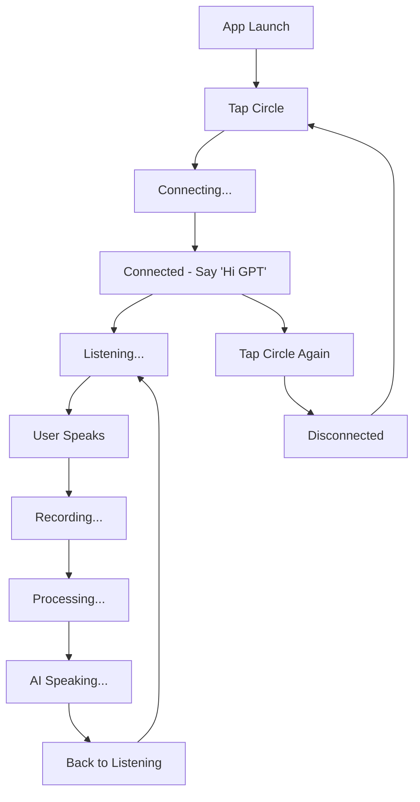

# Echo Dot-Inspired Voice Assistant UI

## Overview
The UI has been completely redesigned to focus on voice-only interaction, inspired by Amazon Echo Dot. The interface is simplified to provide a clean, intuitive experience centered around voice commands.

## UI Components

### 1. Main Circle (Echo Device)
- **Size**: 280px diameter (220px on mobile)
- **States**:
  - **Idle**: Gray border with subtle glow animation
  - **Listening**: Blue border with pulsing animation
  - **Speaking**: Green border with rotation animation

### 2. Status Indicator
- **Position**: Top-right corner of the main circle
- **Colors**:
  - **Red**: Disconnected
  - **Green**: Connected (with blinking animation)

### 3. Wake Instruction
- **Text**: "Say 'Hi GPT' to wake up"
- **Position**: Top 20% of screen
- **Animation**: Breathing effect (scale and opacity changes)
- **Visibility**: Hidden when connected

### 4. Status Text
- **Position**: Bottom 15% of screen
- **States**:
  - "Tap to connect" (disconnected)
  - "Connected - Say 'Hi GPT' to start"
  - "Listening..."
  - "Recording..."
  - "Speaking..."
  - User transcript display

### 5. Audio Visualizer
- **Components**: 3 concentric rings
- **Animation**: Expanding rings during audio activity
- **Visibility**: Shows during listening/recording

## User Interaction Flow

## Visual States

### Color Scheme
- **Background**: Dark gradient (#0f1419 → #1a1f2e → #2d3748)
- **Circle Base**: Radial gradient (#4a5568 → #2d3748)
- **Idle State**: #718096 border
- **Listening State**: #4299e1 border (blue)
- **Speaking State**: #48bb78 border (green)
- **Connected Indicator**: #38a169 (green)
- **Disconnected Indicator**: #e53e3e (red)

### Animations
- **Idle Glow**: 4s ease-in-out infinite
- **Listening Pulse**: 2s ease-in-out infinite (scale 1 → 1.08)
- **Speaking Pulse**: 1.5s ease-in-out infinite (scale + rotation)
- **Connected Blink**: 2s ease-in-out infinite (opacity)
- **Audio Rings**: 2s linear infinite (scale 0.8 → 1.2)

## Key Features

1. **Single Touch Interface**: One button controls everything
2. **Visual Feedback**: Clear state indication through colors and animations
3. **Voice-Only**: No text input or buttons cluttering the interface
4. **Mobile Responsive**: Adapts to smaller screens
5. **Accessibility**: Clear visual indicators for all states

## Technical Implementation

- **CSS**: Pure CSS animations and transitions
- **JavaScript**: Event handling for touch/click interactions
- **WebSocket**: Real-time communication with AI service
- **Audio Processing**: Continuous audio monitoring and processing

## Usage Instructions

1. **Connect**: Tap the circle to connect to the AI service
2. **Wake Up**: Say "Hi GPT" to start a conversation
3. **Speak**: Talk naturally - the system detects voice automatically
4. **Listen**: AI responds with voice
5. **Disconnect**: Tap the circle again to disconnect

The interface provides a seamless, hands-free experience similar to commercial voice assistants while maintaining the advanced capabilities of the GPT-4 Realtime API.