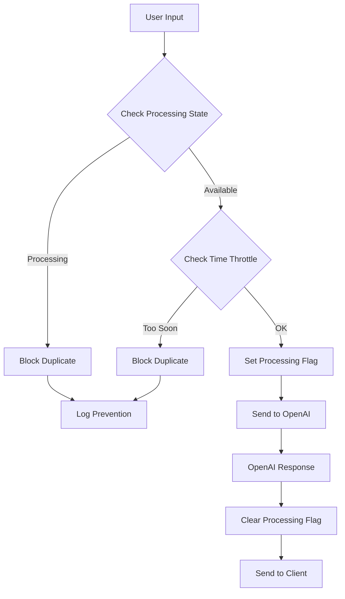

# Echo Fix Summary

## ✅ Changes Made

### 1. Turn Detection Configuration (server.js lines 25-31)
- **Before**: `threshold: 0.5`, `silence_duration_ms: 200`
- **After**: `threshold: 0.6`, `silence_duration_ms: 800`
- **Reason**: Reduces sensitivity to prevent false triggers

### 2. Client State Management (server.js lines 72-81)
- **Added**: `lastResponseTime: 0`, `isProcessingResponse: false`
- **Reason**: Track response state to prevent duplicates

### 3. Audio Response Throttling (server.js lines 121-128)
- **Added**: 3-second throttling check before processing audio
- **Added**: Processing state flag to prevent concurrent responses
- **Reason**: Prevents multiple responses from audio input

### 4. Text Response Throttling (server.js lines 167-176)
- **Added**: 3-second throttling check before processing text
- **Added**: Processing state flag for text responses
- **Reason**: Prevents duplicate text responses

### 5. Response Completion Handling (server.js lines 275-285)
- **Added**: Reset `isProcessingResponse` flag on response completion
- **Added**: Reset flag on error
- **Reason**: Ensures processing flag is properly cleared

### 6. Cleanup on Disconnect (server.js lines 336-339)
- **Added**: Reset response tracking variables
- **Reason**: Clean state when client disconnects

### 7. Environment Configuration (.env.example)
- **Updated**: Default values for turn detection
- **Reason**: Better default configuration to prevent echo

## 🔧 How It Works

## 🎯 Expected Results

1. **Single Response**: Each command will trigger exactly one response
2. **No Echo**: Audio feedback loops are prevented
3. **Better Timing**: Responses wait for proper silence periods
4. **Logging**: Clear logs show when duplicates are prevented

## 🧪 Testing

1. **Update your .env file** with new turn detection values
2. **Restart the server**: `node server.js`
3. **Test single commands**: Verify only one response per command
4. **Test rapid commands**: Verify throttling prevents duplicates
5. **Check logs**: Look for prevention messages

## 📊 Monitoring

Watch for these log messages:
- `"Preventing duplicate response - too soon after last response"`
- `"Preventing duplicate text response - too soon after last response"`
- `"Response completed for client {clientId}"`

## 🔄 Next Steps

1. Test the fixes with your current setup
2. Adjust thresholds if needed based on your environment
3. Monitor logs for any remaining issues
4. Consider implementing client-side duplicate prevention if needed

The echo issue should now be resolved! 🎉